1) enable snippets

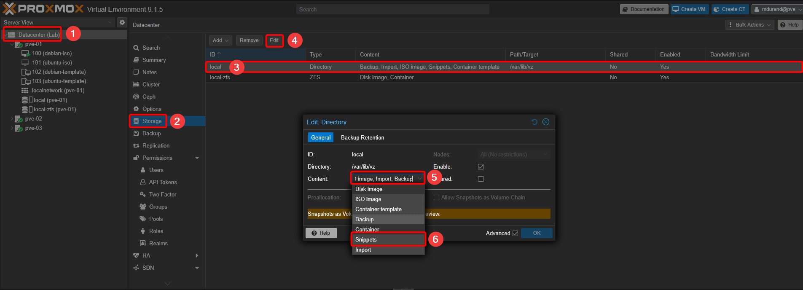
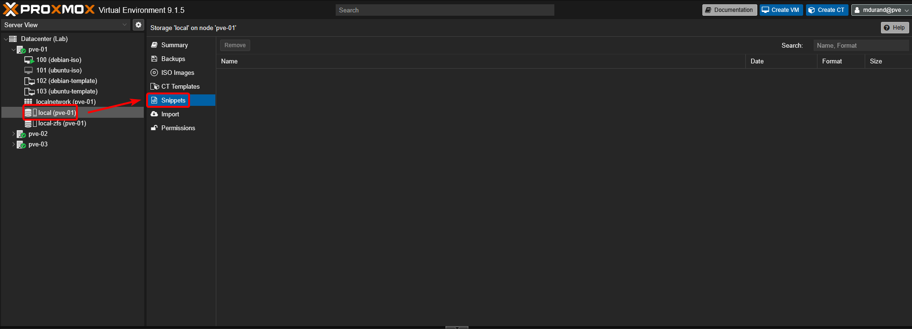

2) create/upload the cloud-init files

  a) with shell
  ```bash
  cd /var/lib/vz/snippets
  nano user-data.yml
  ...
  ...
  ...
  ```
  b) or use you own software to, upload them through SSH in `/var/lib/vz/snippets

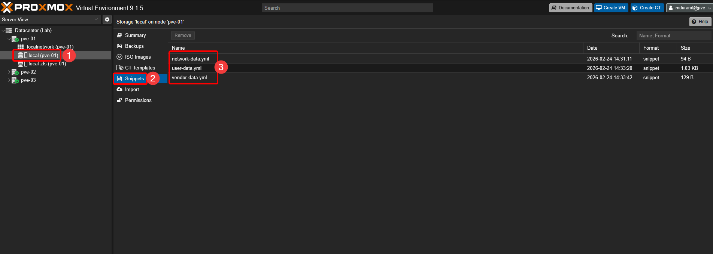

3) Get your cloud image : 
    - Debian : https://cloud.debian.org/images/cloud/ (example : https://cloud.debian.org/images/cloud/trixie/20260220-2394/debian-13-generic-amd64-20260220-2394.qcow2)
    - Ubuntu : https://cloud-images.ubuntu.com/ (example : https://cloud-images.ubuntu.com/jammy/20260219/jammy-server-cloudimg-amd64.img) **you have to change the extension to .qcow2 in order to use this image**

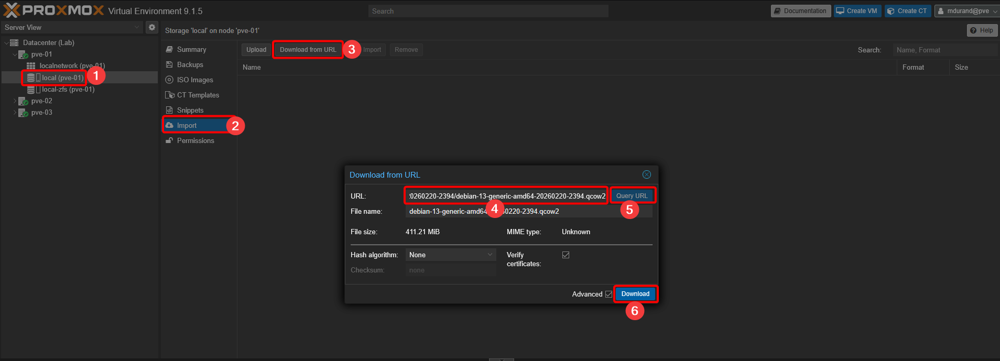
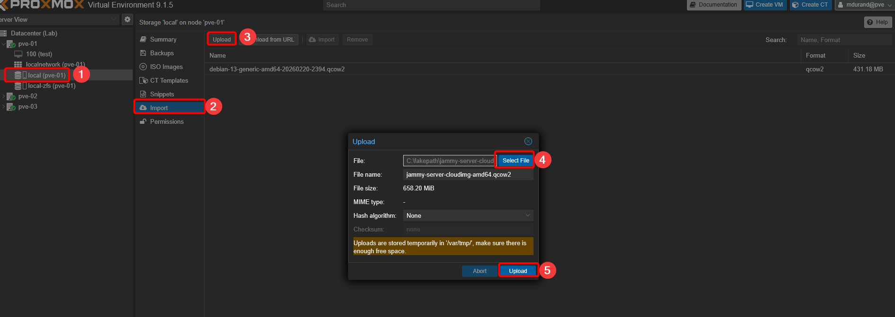

4) Create a new VM

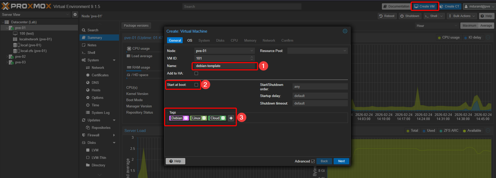
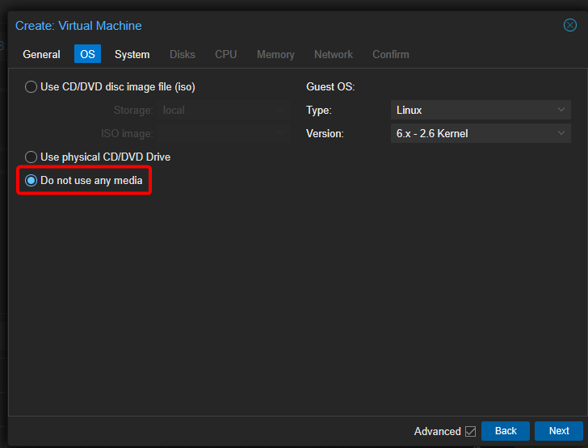
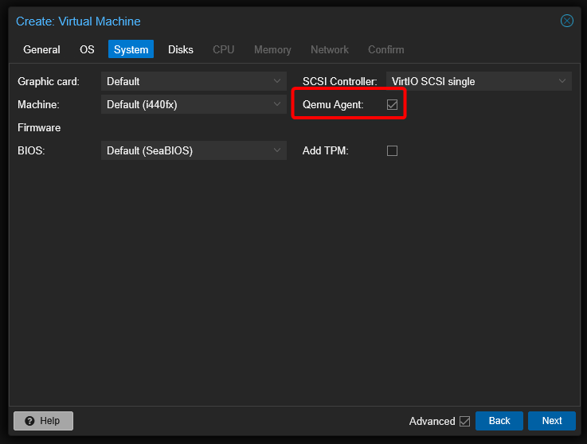
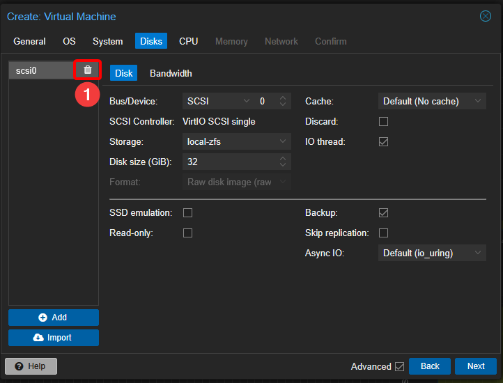
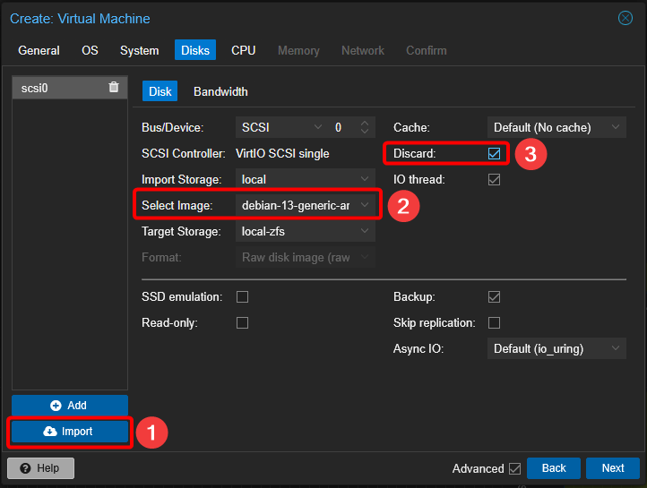
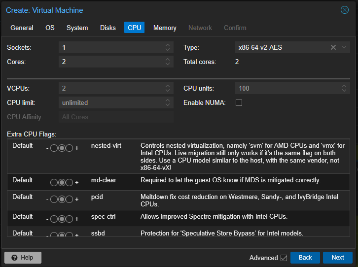
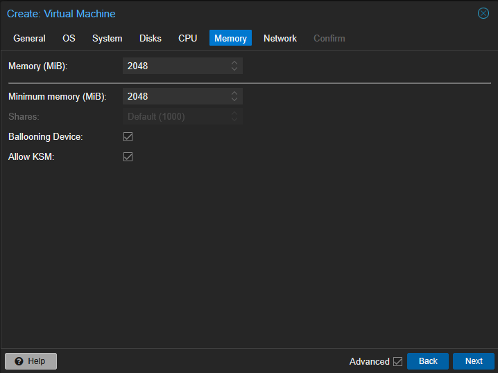
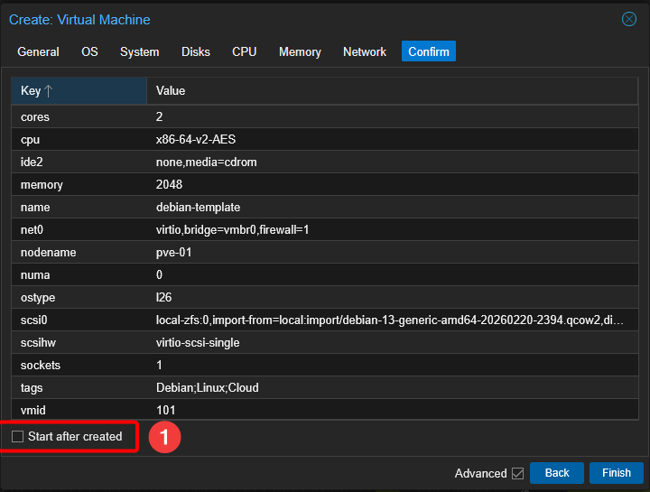

5) Add Cloud-init drive

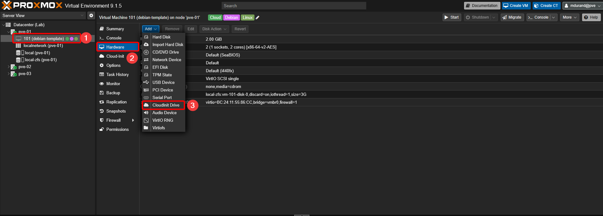
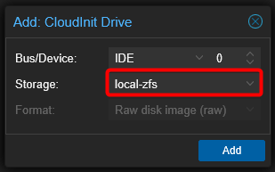

6) Renseigner les fichiers à utiliser via le shell et générer l'image ISO
```bash
qm set 101 --cicustom "user=local:snippets/user-data.yml,vendor=local:snippets/vendor-data.yml,network=local:snippets/network-data.yml"
qm cloudinit update 101
```

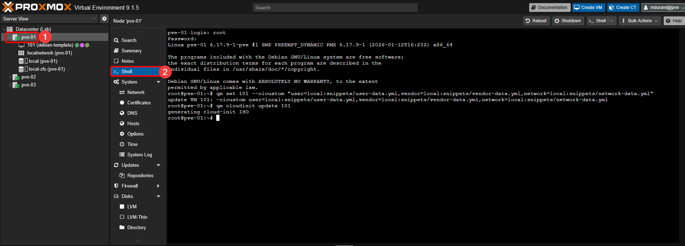

7) Convertir la VM en template pour pouvoir la réutiliser au besoin

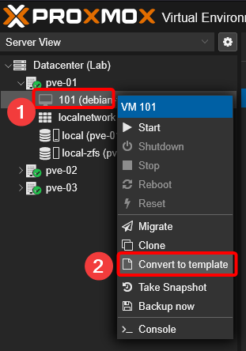

8) créer une nouvelle VM a partir du template

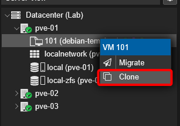
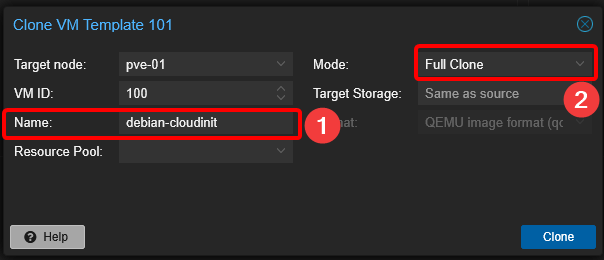


9) demarrer la VM, le cloud init s'effectue

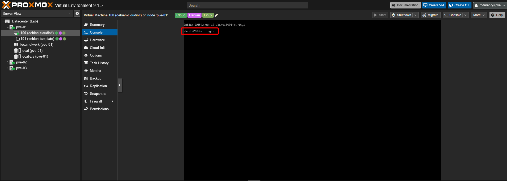
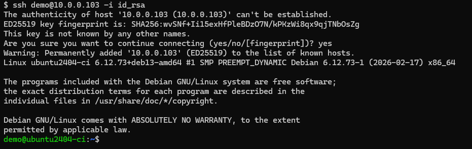

10) après reboot, l'agent est bien fonctionnel

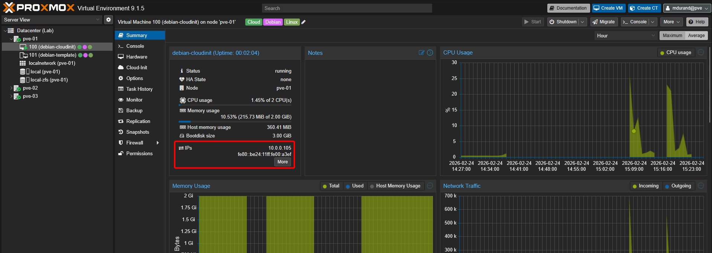
